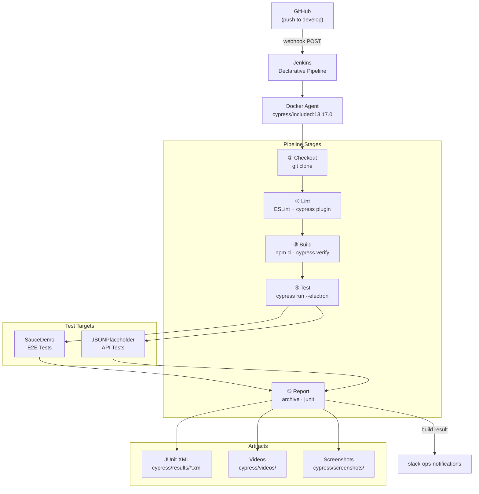

# Jenkins + Cypress CI/CD Pipeline

CI/CD pipeline running Cypress E2E test suites inside Dockerized Jenkins agents, with staged execution: checkout → lint → build → test → report.


---

## Pipeline Stages

| Stage | What it does | What makes it fail |
|---|---|---|
| **Checkout** | Clones the repository via `checkout scm` using the SCM configuration defined in the Jenkins job | Invalid credentials, branch not found, or network connectivity issues reaching GitHub |
| **Lint** | Runs `npm run lint` (ESLint 8 with `eslint-plugin-cypress`). Enforces the `cypress/recommended` ruleset, including `unsafe-to-chain-command` | Any ESLint rule violation or JS syntax error in `cypress/**/*.js` |
| **Build** | Runs `npm ci` for a clean, reproducible install from `package-lock.json`, then `npx cypress verify` to confirm the binary is functional | `package-lock.json` out of sync, npm registry unavailable, or Cypress binary corruption inside the Docker image |
| **Test** | Runs `npx cypress run --browser electron` (headless). Uses `catchError` so the pipeline always continues to the Report stage; a test failure marks the build **UNSTABLE** rather than **FAILED** | Individual test assertions fail (build → UNSTABLE) or Cypress crashes entirely (build → FAILED) |
| **Report** | Archives `cypress/videos/**/*.mp4` and `cypress/screenshots/**/*.png` as Jenkins artifacts; publishes `cypress/results/*.xml` to the JUnit trend graph | No XML files generated (only if Cypress crashed before writing any results) |

The `post { always }` block re-archives videos and runs `cleanWs()` regardless of build outcome, so artifacts are never lost even when early stages fail.

---

## Architecture Diagram



---

## Docker Setup

Jenkins runs inside Docker with the Docker socket mounted so it can spin up ephemeral `cypress/included` containers as build agents. No permanent agents are needed — each build gets a clean, isolated environment.

| Component | Image |
|---|---|
| Jenkins server | `jenkins/jenkins:lts-jdk17` + Docker CLI (see `jenkins.Dockerfile`) |
| Cypress build agent | `cypress/included:13.17.0` |

Start the stack:

```bash
docker compose up -d --build
```

See **[docs/setup-jenkins.md](docs/setup-jenkins.md)** for the full walkthrough: initial admin setup, required plugins, pipeline job creation, and GitHub webhook configuration.

---

## Test Plan

Seven test cases covering login, inventory, checkout (E2E), and REST API flows. See **[docs/test-plan.md](docs/test-plan.md)** for the full table.

| ID | Feature | Type | Result |
|---|---|---|---|
| TC-001 | Login | E2E | Redirects to `/inventory` |
| TC-002 | Login | E2E | Error message visible |
| TC-003 | Inventory | E2E | Cart badge shows `1` |
| TC-004 | Inventory | E2E | Prices in ascending order |
| TC-005 | Checkout | E2E | `Thank you for your order!` |
| TC-006 | API | API | Status 200 + valid body schema |
| TC-007 | API | API | Status 201 + echoed payload |

---

## Reports

Each pipeline run produces three types of output, all accessible from the Jenkins build page:

**JUnit XML (`cypress/results/*.xml`)**
Generated by `mocha-junit-reporter` via `cypress-multi-reporters`. One XML file per spec, named with a content hash. Jenkins parses these to build the test trend graph and flag individual failing tests. Configured in `reporter-config.json`.

**Videos (`cypress/videos/`)**
Cypress records an MP4 for every spec run. Archived as Jenkins build artifacts even when all tests pass — useful for debugging intermittent failures.

**Screenshots (`cypress/screenshots/`)**
Cypress captures a PNG automatically when a test assertion fails (`screenshotOnRunFailure: true` in `cypress.config.js`). Archived alongside videos. On a green run this folder is empty.


---

## Branching

| Branch | Purpose |
|---|---|
| `main` | Stable, release-ready code. Protected — no direct pushes. |
| `develop` | Active development. All work is committed here and validated by the Jenkins pipeline before merging to `main`. |

**Flow:**

```
feature → develop (Jenkins pipeline runs) → PR → main
```

Every push to `develop` triggers the full pipeline via GitHub webhook. Merges to `main` require the `develop` pipeline to be green.

---

Pipeline results are posted to Slack using templates from [slack-ops-notifications](https://github.com/Alexis2104/slack-ops-notifications).
